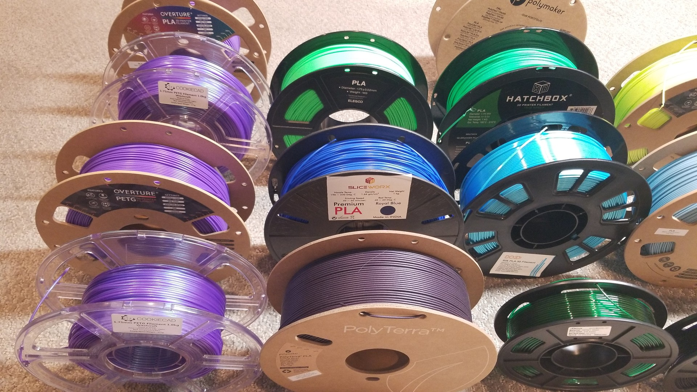
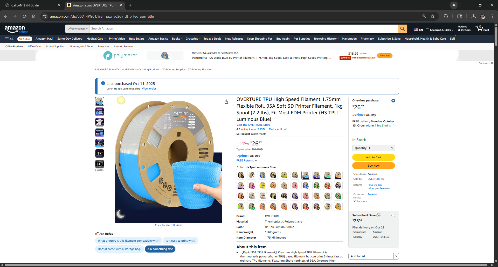
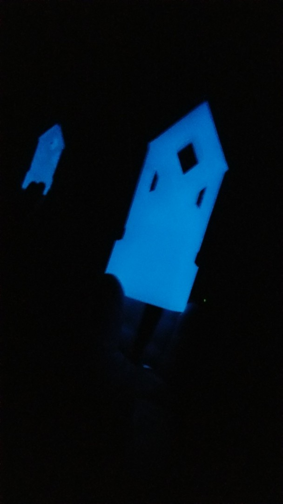

# Zelda Master Sword build

This repo's tracking building a Zelda Master Sword with my kid.  We're Making https://www.printables.com/@Popandsicle's neat design, with various Community remixes, and may create/contribute our own remixes too...

## Models

Model files:
- Original model https://www.printables.com/model/252630-legend-of-zelda-master-sword-botw-totk-full-scale
- Remix of Wings https://www.printables.com/model/555004-master-sword-master-sword-zelda-zelda-zelda-master
- Consider remix(es) for blade sections, e.g. https://www.printables.com/model/654725-joiner-and-anchor-fused-for-legend-of-zelda-master 

## BOM
- Blade: Luminous Blue OVERTURE TPU 95A High Speed https://www.amazon.com/dp/B0DT4PG61J
- Hilt: Matte Army Purple PolyMaker (2024/5 spool, not sold now) https://www.amazon.com/dp/B0C4LMH589 
- Embelishments/Pins: Silk Gold OVERTURE PLA  https://www.amazon.com/dp/B087RP8NNZ 
- Grip Wrapping: Transparent Green, AMOLEN PETG https://www.amazon.com/dp/B08Z77GCM4

## History

2025-10-15
- Shipped! $31.40 via [USPS priority-mail-flat-rate-large-box](https://store.usps.com/store/product/shipping-supplies/priority-mail-flat-rate-large-box-P_LARGE_FRB), 3-4 days.  Guessing better rates available.
- Used remaining glow TPU for the hidden Pins and Hilt Anchor.

2025-10-12 to 2025-10-14
- Parts all printed.  1kg was enough for all Blade sections, including reprint of a large section.  Glow TPU Spool still has ~100g left. 
- Did minimum cleanup to verify fit.

2025-10-11 
- Looking for a glow in dark HS TPU.  Maybe Overture's Luminous Blue for sword, not sure if it glows, asked Overture folks/community  https://discord.com/channels/1142991509570990120/1143235138382221344/1426621513716596760.  Product image shows Sun and Moon, so, ordered a spool to try out...
  - Answer:  @OvertureGreg confirmed Luminous Blue glows in the dark.  Ordered a spool from AMZN.  Greg shared video at https://discord.com/channels/1142991509570990120/1143235138382221344/1426649207909126235 
- Feedback comments call out that the model has tight tolerances, some struggle to assemble.  So, haven't calibrated my printer in a while, so kicking off a cali-lantern calibration print...
- Extracted and analyzed [823 Makes and Comments](https://www.printables.com/model/252630-legend-of-zelda-master-sword-botw-totk-full-scale/comments), used ChatGPT to summarize... https://chatgpt.com/c/68ead19c-57ec-8330-b7fe-06fd147baa1d and help identify learnings, DOs/DON'Ts, and interesting remix/mod ideas to try.  Attached text representation of the comments content... file://./res/printables-252630-comments.txt

2025-10-10 
- Sync'd on colors and scale.  
- Can scale up 135% on 250mm bed, and 160% on 300mm bed (depending on available height...)
https://discord.com/channels/1142991509570990120/1143235138382221344/1426621513716596760

## ⚔️ Design & Inspiration
> Picking colors for the bestest sword, and dialing in that perfect hero-grade glow.

---

## 🧩 Printing the Parts
> Long nights, brim skimping fails, reprints, and test fits.  The usual maker's journey...

---

## 💡 Material Experiments
> Chasing that otherworldly glow...

---

## 🧰 Cleanup & Finishing
> Time to make it worthy of a hero...  Trimming, sanding, and polish before the test mount.

---

## 📦 Project Box & Shipping
> Packed, labeled, and ready for the next adventure...

